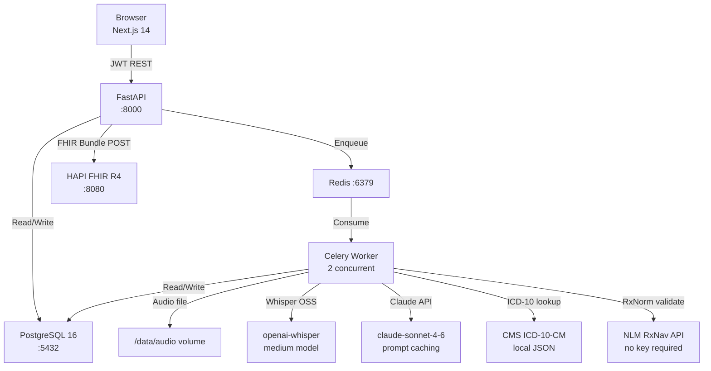
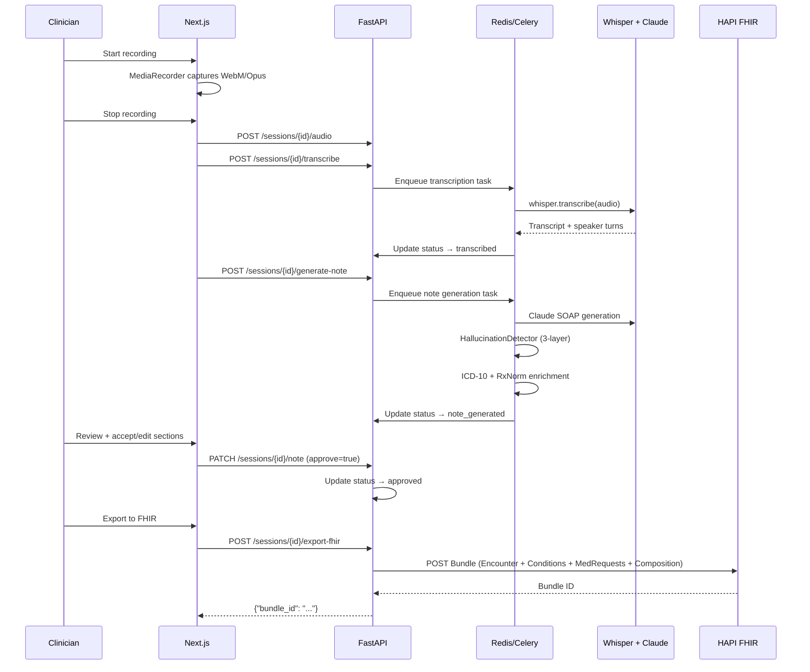

# Ambient Clinical Scribe

AI-powered ambient documentation for clinical encounters. A clinician speaks during a patient visit — the system transcribes with Whisper, generates a structured SOAP note via Claude, detects hallucinations, enriches with ICD-10/RxNorm codes, and exports a valid FHIR R4 bundle to HAPI FHIR.

Demo video coming soon.

---

## Quick Start

```bash
# Copy environment config
cp .env.example .env
# Add your ANTHROPIC_API_KEY to .env

# Start all services
make up

# Run database migrations and seed demo user
make migrate
make seed

# Frontend is included in docker compose at http://localhost:3000
```

Services:
| Service | URL |
|---------|-----|
| Frontend | http://localhost:3000 |
| Backend API | http://localhost:8000 |
| API docs | http://localhost:8000/docs |
| HAPI FHIR | http://localhost:8080/fhir/metadata |

Demo credentials: `clinician@demo.test` / `password`

---

## Deployment

Railway deployment templates live in `deploy/railway/`:

| Service | Config |
|---------|--------|
| Backend API | `deploy/railway/backend.toml` |
| Celery worker | `deploy/railway/worker.toml` |
| Frontend | `deploy/railway/frontend.toml` |

Use Railway Postgres and Redis add-ons, then set `DATABASE_URL`, `REDIS_URL`, `ANTHROPIC_API_KEY`, `JWT_SECRET`, `CORS_ORIGINS`, and `NEXT_PUBLIC_API_URL` as described in `deploy/railway/README.md`.

Add the Loom demo link here after the public recording is ready.

---

## Architecture



### Full Encounter Flow



---

## Standards Integration

| Standard | Usage |
|----------|-------|
| FHIR R4 | Encounter, Condition, MedicationRequest, Composition, DocumentReference |
| ICD-10-CM | CMS local lookup — validates assessment codes |
| RxNorm | NLM RxNav API — validates medication CUIs |
| LOINC | Composition type code 11488-4 (Consult note) |
| SNOMED CT | Encounter class codes via v3-ActCode |
| HL7 v3 | Act codes for encounter classification |

---

## Eval Harness

Reproducible evaluation against 5 synthetic encounter fixtures.

```bash
make eval
```

### Metrics

| Metric | Target | Method |
|--------|--------|--------|
| Medication recall | ≥ 90% | Exact name match vs gold standard |
| ICD-10 top-3 accuracy | ≥ 85% | Exact code match in top-3 predicted |
| Hallucination rate | ≤ 5% | Meds not found in transcript text |
| Prompt cache hits | — | Anthropic SDK usage metadata |

Fixtures: 5 synthetic encounters covering hypertension/angina, type 2 diabetes, osteoarthritis, anxiety/depression, and community-acquired pneumonia. Gold-standard SOAP labels hand-annotated in `test_data/gold_standard/`.

---

## Testing

```bash
# Unit tests
cd backend && pytest tests/unit/ -v

# Integration tests (requires running Postgres)
cd backend && pytest tests/integration/ -v --cov=app --cov-report=term-missing

# Via Docker
make test
```

---

## Tech Stack

| Layer | Technology |
|-------|------------|
| Frontend | Next.js 14 App Router, TypeScript, Tailwind CSS, Zustand, TanStack Query |
| Audio | MediaRecorder API, wavesurfer.js |
| Backend | FastAPI (Python 3.12), SQLAlchemy async, Alembic |
| AI — transcription | openai-whisper (medium model, local) |
| AI — SOAP generation | Claude claude-sonnet-4-6 with prompt caching |
| Hallucination detection | Exact match + rapidfuzz + sentence-transformers (all-MiniLM-L6-v2) |
| FHIR | fhir.resources, HAPI FHIR R4 (Docker) |
| Database | PostgreSQL 16 |
| Queue | Redis 7 + Celery |
| Auth | JWT (python-jose), bcrypt |
| Infrastructure | Docker Compose |

---

## Key Directories

```
backend/app/
  api/routes/     # auth, sessions, audio, notes, fhir
  services/       # soap_note, fhir_export, hallucination_detector, icd10
  models/         # SQLAlchemy: user, session, transcript, soap_note, audit_log
  tasks/          # Celery workers: transcription, note_generation
  eval/           # Eval harness: run_eval.py, scorer.py
frontend/src/
  app/            # Next.js pages: /login, /dashboard, /sessions/[id]
  components/     # audio-recorder, session-list, soap-editor, transcript-view
  hooks/          # useSession, useNote
  stores/         # Zustand auth store
test_data/
  fixtures/       # 5 synthetic encounter transcripts
  gold_standard/  # Hand-annotated SOAP labels for eval
```

---

## HIPAA Note

**Demo only.** All patient data is synthetic (Synthea-generated or manually created). No real PHI. No BAA in place. Not for clinical use.

For production deployment, additional controls required: encryption at rest, audit logging (partially implemented), auto-logoff, BAA with cloud providers, and a formal HIPAA risk assessment.

---

## Regulatory Scope

The SOAP note generation component functions as a clinical documentation aid — not a diagnostic decision support tool — and does not recommend treatment pathways. Under the 21st Century Cures Act, ambient documentation tools that passively assist with note creation are generally outside the CDS Hooks definition of "patient-specific" decision support requiring FDA oversight, provided they do not trigger automatically without clinician review and do not lock in treatment decisions.

All generated notes require explicit clinician approval (section-by-section accept/edit/reject) before export or storage as final.
